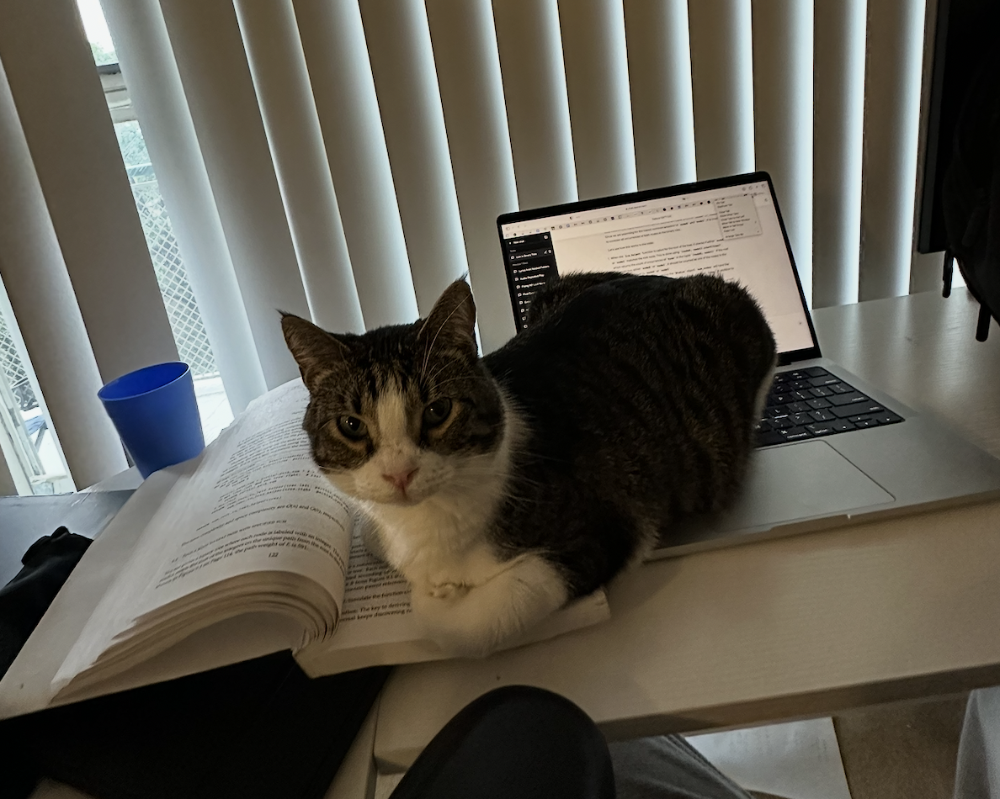
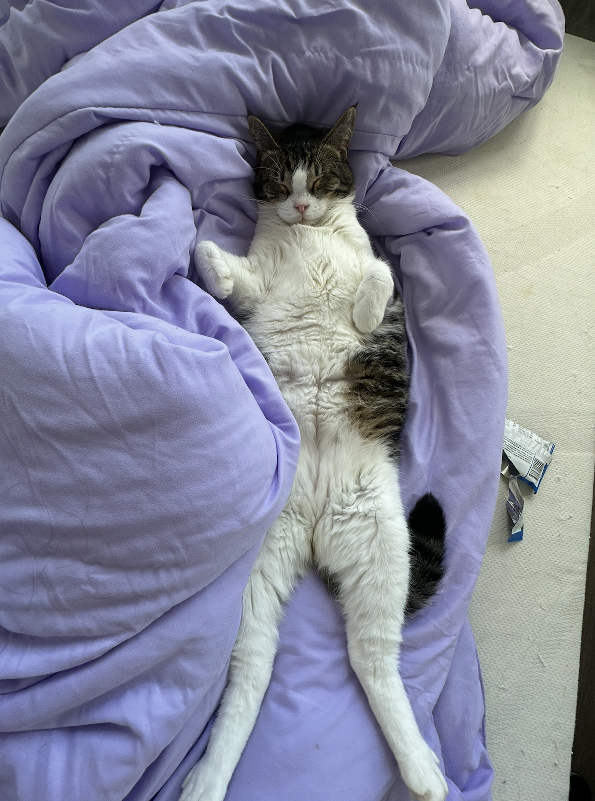
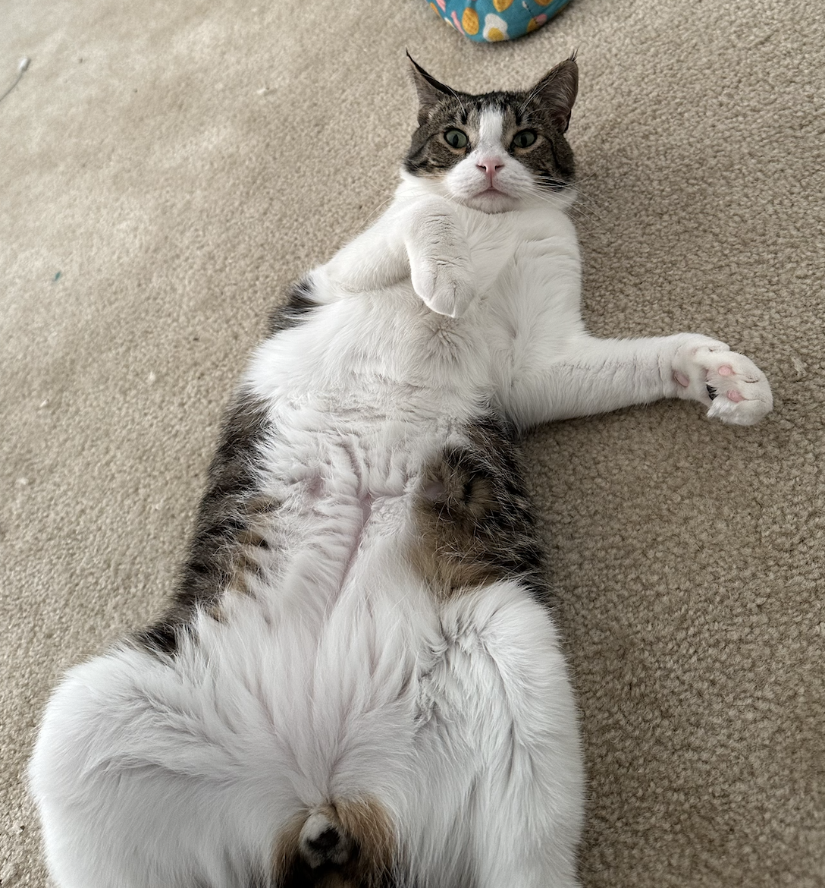
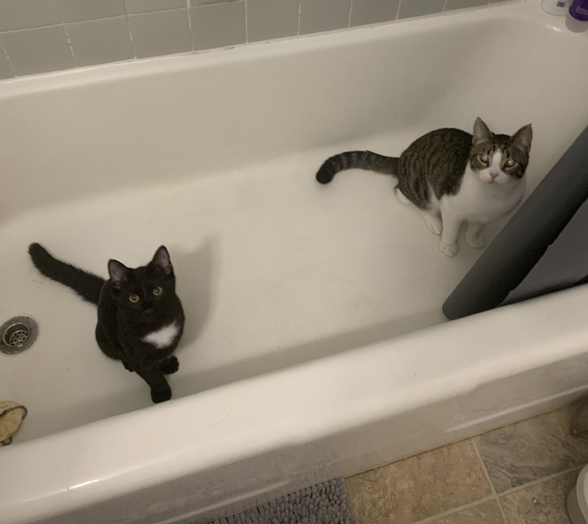
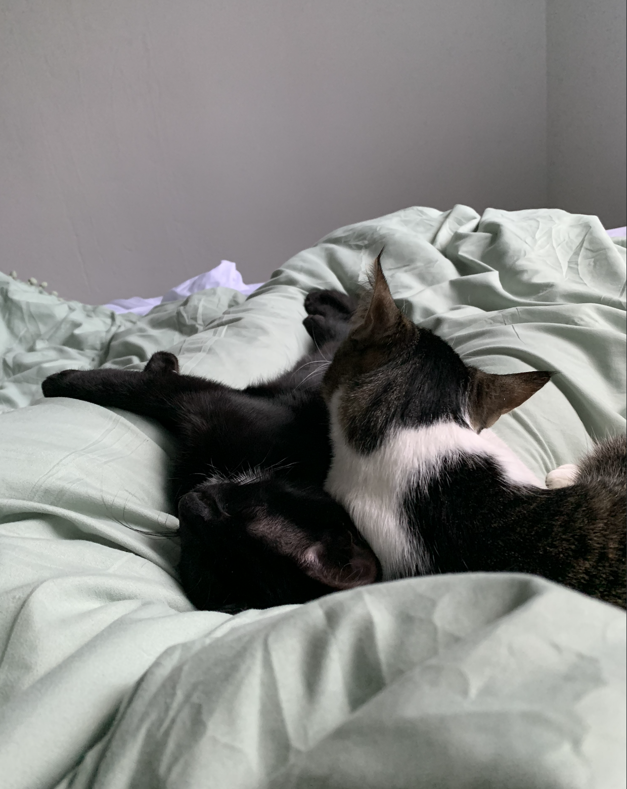
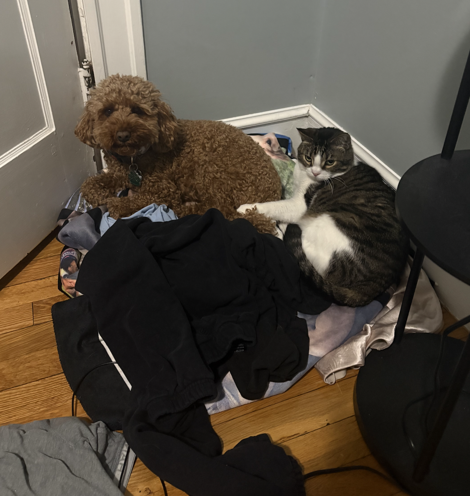
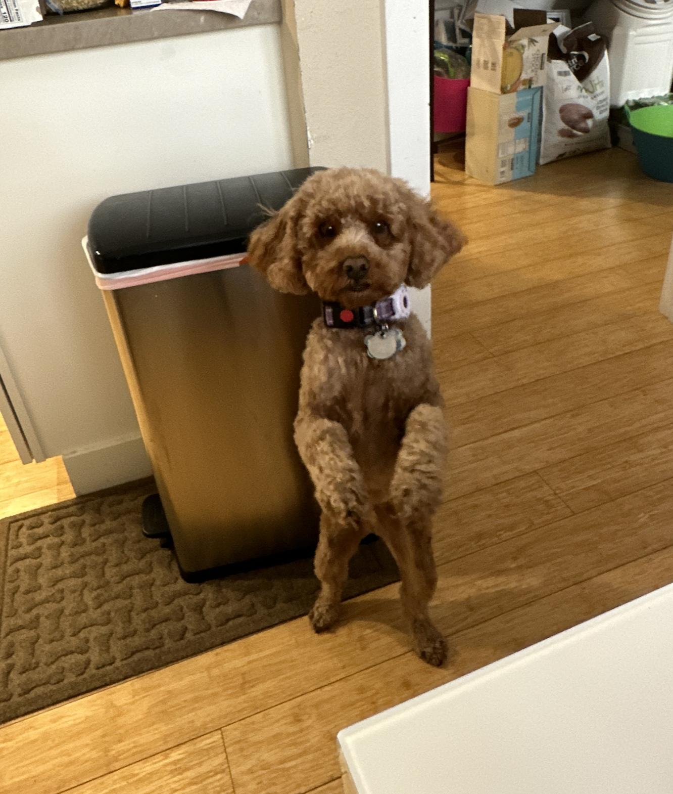
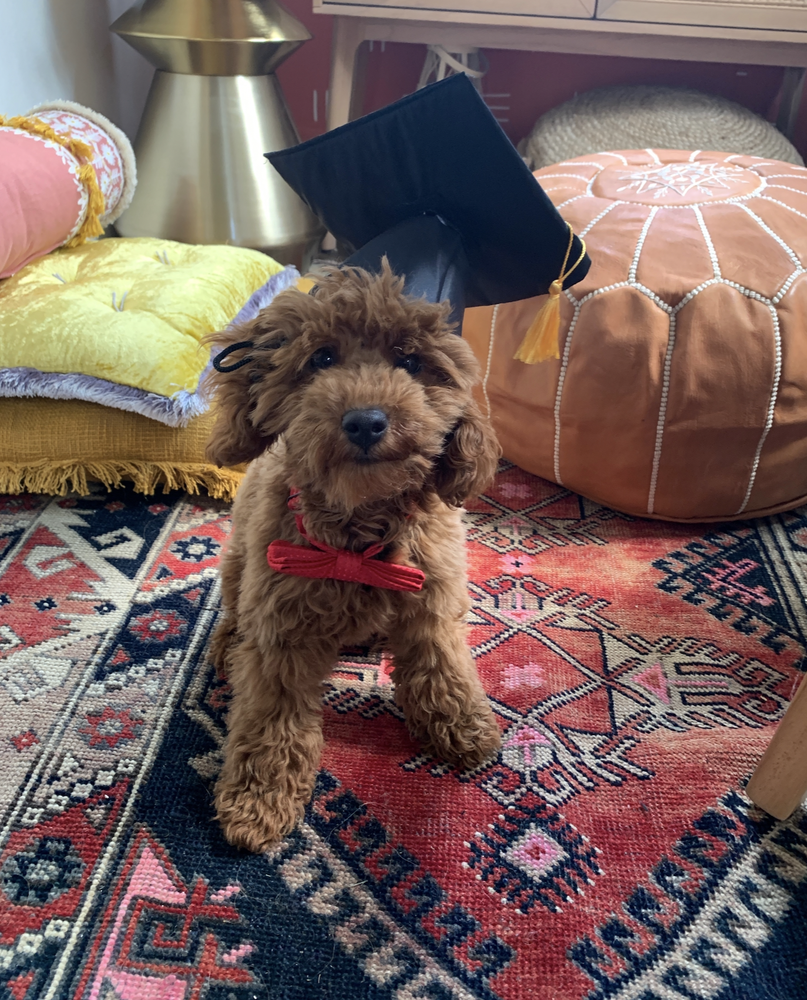
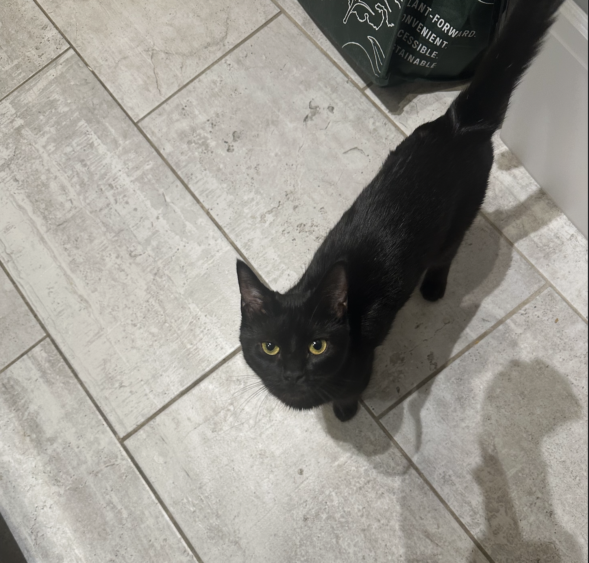

### Chulo
Chulo was a stray cat who followed me home when I was walking Teddy in the summer of 2022, and he has been mine ever since. He is the goofiest cat I know. He LOVES all humans and animals.

Fun fact: Chulo prefers to lay belly up.

---

### Luna 
Luna is the athletic cat in our household. She loves climbing, laying on my computer, and cuddling.         

---

### Teddy 
Teddy was my first pet, and he showed me how awesome animals really are. He is the best dog I could ever ask for. He loves hiking, learning new tricks, and watching horses on TV.      

---

### Fosters
#### Current foster: Morgana  
Morgana is the sweetest cat I've met. She purrs whenever we pet her, and she LOVES food.
 